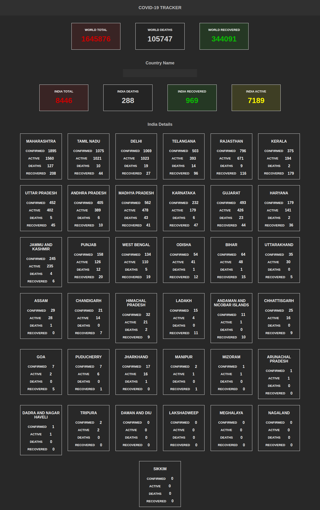

# Covid-19 Tracker

This is a simple react app that fetches data regarding the ongoing coronavirus pandemic from [api.covid19api.com](api.covid19api.com) for global data and [api.covid19india.org](api.covid19india.org) for details if India, upto the state level. The app renders all the data in a nice dark theme based UI. Users can also view data for a specific country as well.

## Skills Used

1. React
2. Redux

## Screenshot

### Update April 12, 2020

-   Added more CSS styling to make page look more attractive.
-   Added state level details for India
-   Updated redux code and used new API for fetching data
-   Added footer to add credits to creator
-   Removed unnecessary boilerplate and files

### April 13, 2020

-   Made completely responsive. Windows resizes automatically on smaller screens.
-   Added a line graph for India data only.
-   Minor styling and fresh looks
